# CUDA Stream Compaction

**University of Pennsylvania, CIS 565: GPU Programming and Architecture, Project 2**

-   Yu Jiang
    -   [LinkedIn](https://www.linkedin.com/in/yu-jiang-450815328/), [twitter](https://x.com/lvtha0711)
-   Tested on: Windows 11, Ultra 7 155H @ 3.80 GHz, 32GB RAM, RTX 4060 8192MB (Personal Laptop)

## Features

### 1. CPU Scan & Stream Compaction

Just use for-loop to do all algorithm, and make sure this is correct because we have to use this one as correct result to compare other GPU methods' correctness.

### 2. Naive GPU Scan Algorithm

Dispatch the kernel each pass for one stride, and use ping-pong buffers to save the intermediate results of each pass. A for-loop for stride is used on the host.

### 3. Work-Efficient GPU Scan & Stream Compaction

#### 3.1 Scan

Firstly I implement a kernel using upsweep and downsweep to get the exclusive scan result inside each block, and save the total sum of each block into another buffer. In the kernel, do upsweep in for-loop for the offset length first, in each loop end add a `__syncthreads()` to make sure results are written correctly; similar for downsweep.  
Then I implement a host function which can recursively devide the whole array by blocksize, since we have to do another exclusive scan for sums of each block. When the arraysize is <= than blocksize, that's the terminal condition so we can return to last level.  
For the outermost scan function, I will allocate a series of device memory (the size is decreased by `blockSize`) and save them in a `std::vector`, so I don't need to allocate memory during the recursive function.

#### 3.2 Stream Compaction

By implementing `StreamCompaction::Common::kernMapToBoolean` and `StreamCompaction::Common::kernScatter`, I compute the boolean result and copy it to the first level of device memory series, then perform scan to compute the index, and scatter the array at last.

### 4. Using Thrust's Implementation

Just using thrust::exclusive_scan API is OK. (note that thrust is very slow in Debug Mode)

### 5. Why is My GPU Approach So Slow? (Extra Credit)

In my implementation, I use a complete kernel which can compute the whole process of scan within each block, so there's no such problems about thread numbers and number of blocks, the performance of Efficient method is faster than naive approach and CPU if there's enough data (about 65k, below that all GPU approach even thrust is slower than CPU).
For the question asked in this part, I think it's not let a thread handling the data just equal to it's `tid`; instead we should handle the data of `(tid + 1) * twooffset - 1`, so we can quit half of the warps at each level, getting better performance.

### 6. Extra Credit

#### 6.1 Radix Sort

In my implementation, I use a outer for-loop for digits. In each digit's loop, I first use a kernel to compute the e(or b) value, and save that directly to the first level of device memory series, then perform scan to compute the f index, and use another kernel to compute t index for each thread, at last a scatter kernel is used to compute the real index and put the values into its right place.  
There's also a ping-pong buffer used to save sorted results after each digit's loop.

#### 6.2 Shared Memory GPU Scan

In my implementation, I tried three different types of algorithm about shared memory:

-   The first one is just copying Efficient method, and replacing all global read/write with shared read/write, since this algorithm is only scaning within each block so we can just load all values into the shared memory(one per thread) and then use them. (But this one's performance is not good on my GPU, **See performance analysis later**)
-   The second one is after I analyze the performance of the first one, in this method I'm not using the upsweep-downsweep workflow, instead I just implement a naive method for each block (and use shared memory for sure) and use `__syncthreads()` to sync within blocks rather than one kernel call per pass. (This one's performance is even better than the first one)
-   The third on is implementing naive method at lower levels -- that is for each warp, and do a scan for the sum of each warp and add them later to complete the whole scan for the block. In this implementation, `__shfl_up_sync()` is used to get the value of neighbor threads (within each warp) and sync them much faster than `__syncthreads()`, and suprisingly, this one's performance is the best among all my implementations.

## Performance Analysis

### 1. Blocksize

For the naive implementation, the best blocksize is 256;  
And for Efficient implementation, the best blocksize is 512.

### 2. Time Cost Comparison

This is a picture of time cost for all methods of scan, each method is using its best blocksize, and array size goes from 2^20 to 2^27.
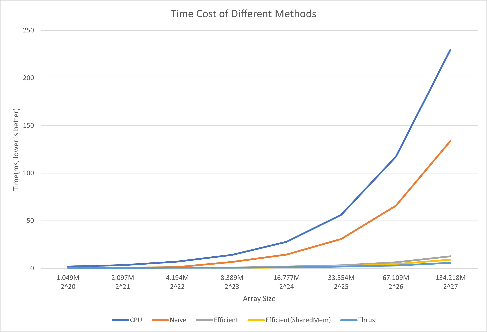

Since the time cost of CPU and Naive method is too high so I include another picture without them to show better for Effective methods.
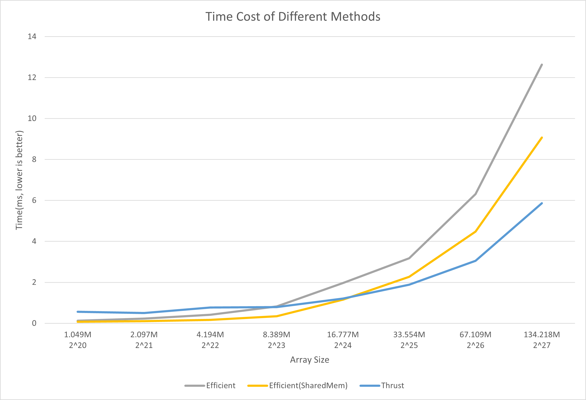

### 3. Analysis of Time Cost

All the implementation's time cost grows when the arraysize goes up. And except for the thrust implementation, the grow speed is linear. But for thrust, the grow speed is lower than linear, so we can see that thrust performs worse than our implementation when arraysize < 2^24, but it performs better after arraysize > 2^25.

#### 3.1 Naive Method

For the naive method, we can see that the compute pipelines are under utilization
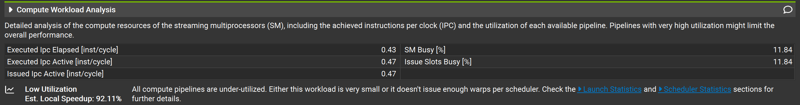
But the memory throughput is around 87%, which means that this kernel is limited by load/stores. More specifically, the chart shows that it's the load/store of global memory.
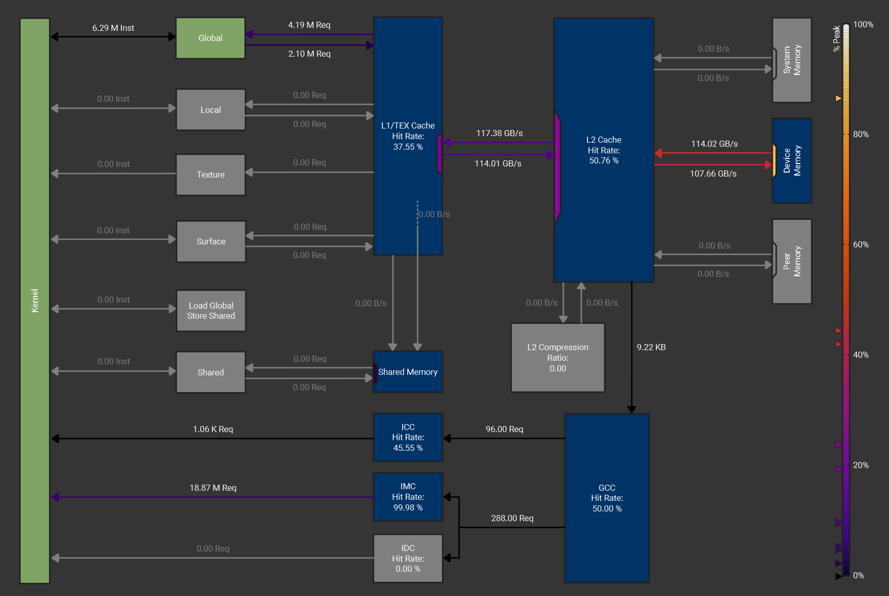
And for the whole naive method, we need 26 kernels, each of them needs at least 1 LDG, 1 STG, so in total there will be lots of global memory load/store overhead.

#### 3.2 Efficient Method

For the efficient method, we reduce the number of add and swap operations, and in total the memory load/store counts also decreases a lot, but there's still lot's of global memory load/store, which is more bound than compute.
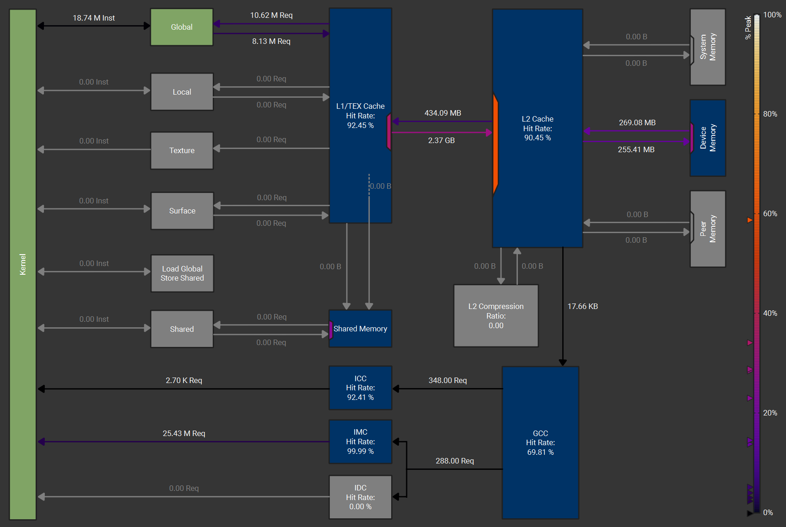
But because we are doing scan within each block, cache hit rate is really high so most load stalls for only L1/TEX cache load cycles rather than global (**Note that this is important**)

#### 3.3 Thrust Method

We don't know the detail implementation of thrust, but we can see from the Nsight that there's only 3 kernel dispatches:  
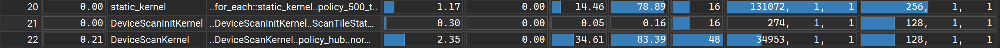
The first kernel `static_kernel` only has memory write, and look at the block size it's 2 element per thread.  
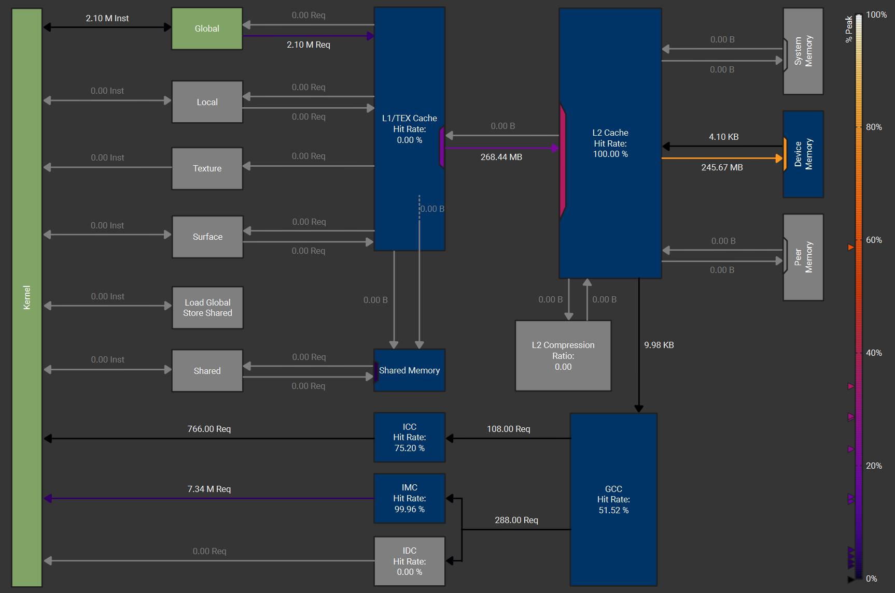
The second kernel `DeviceScanInitKernel` is a relative small kernel, and it costs little time.  
The third kernel `DeviceScanKernel`, I **think** that this is the true kernel of doing scan. And look at that strange block number, I **think** that it's doing all the scans (both within block and the scan of blocksum) using the same kernel and dispatches them in one call. I don't know how this can be achieved but there's no other ways if there's no extra kernel to add back blocksum scanned result.  
And, I also **think, that thrust is not using the upsweep-downsweep workflow**, because when we look at it's memory graph, there's very less memory access (both global and shared), and it's very similar to my third shared memory implementation using `__shfl_up_sync()` which can access neighbor threads' value directly through registers, so this can cut down really most of the memory access.


### 4. Analysis towards Shared Memory

Looking back to what I mentioned before, the first implemetation, which is **easily replacing all global read/write with shared read/write**, has a bad performance.  
This is because:

1. this kernel is still actually a **memory bound** kernel, not compute, so lessen the # of adds and swaps has little impact on performance. In contrast, if there's less memory access, the kernel will be faster obviously. To validate this, compare the time cost of my second implementation using shared memory, in this implemetation we use naive within each block, so there's less memory access (regardless of global or shared, the total access number is less than efficient method) than upsweep-downsweep, and it's better than the effective.
   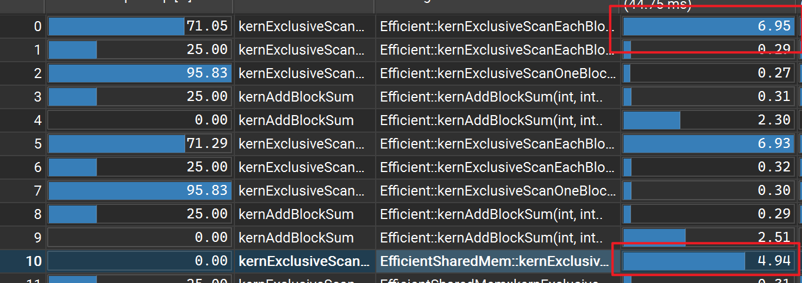

2. Actually, the effective method is utilizing the L1/TEX cache very most, and in Ampere/Ada Lovelace, shared memory is the same physical memory of user managed shared memory:
   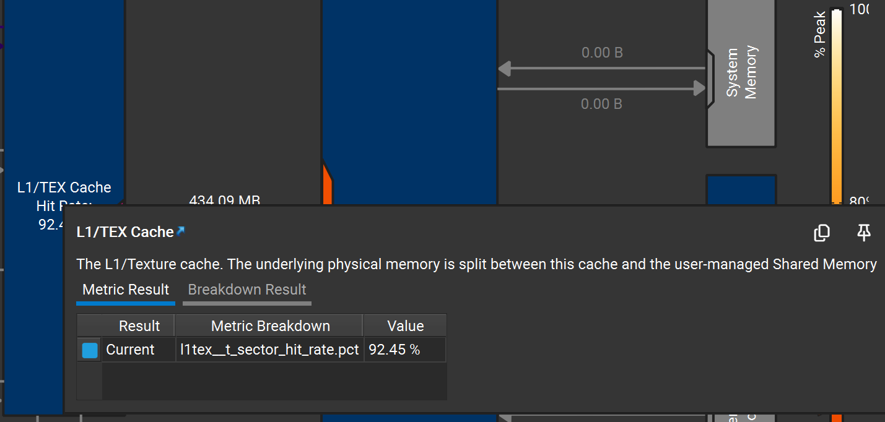
   So the 92.5% hit rate of L1/TEX cache means introducing sharedmem in this way give us small improvement, but introducing more memory accessing (from L1 cache to shared, which is useless) and `__syncthreads()`, which make this intuitive implementation slow. Below is the memory graph of that method:
   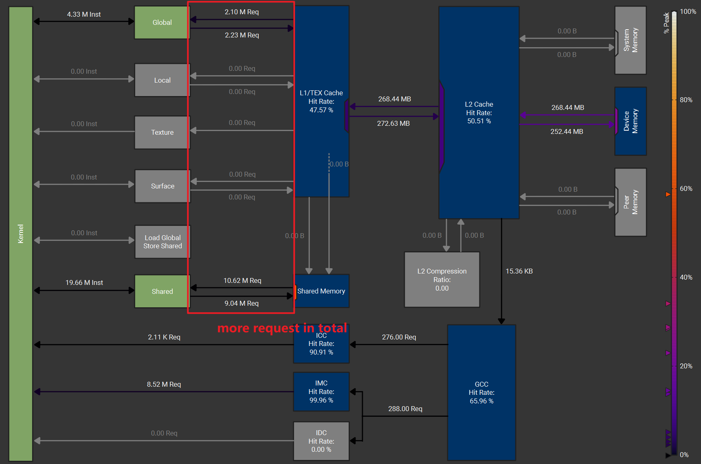

3. So to reduce the number of every type of memory access, the third implementation uses `__shfl_up_sync()` avoid most global and shared memory access, so it's really fast then.
   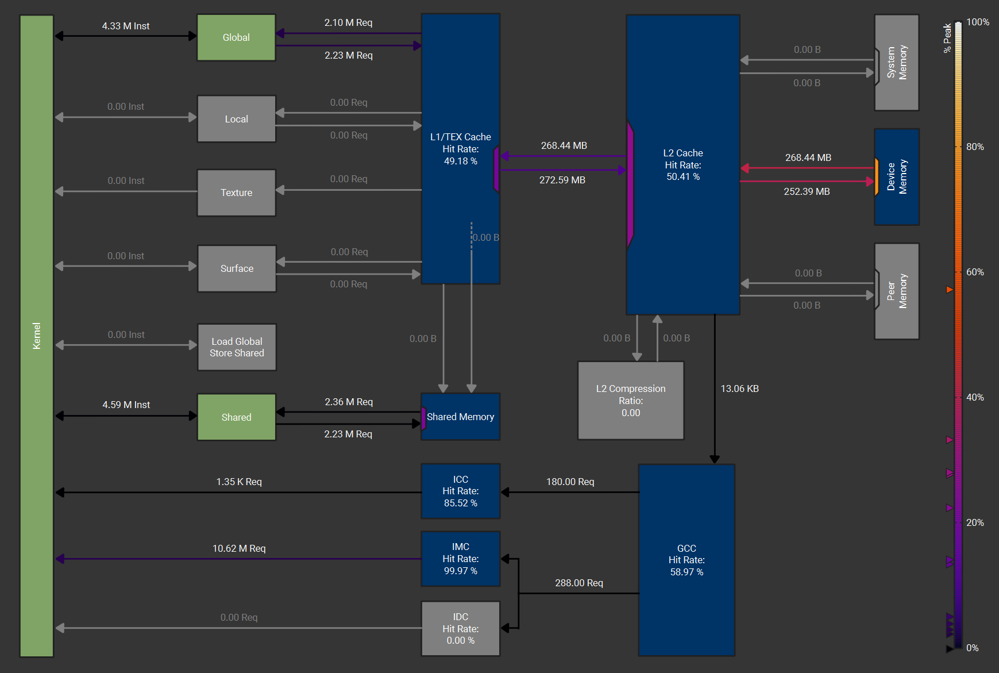

## Output

```
****************
** SCAN TESTS **
****************
    [   4  38  48  42  49  28  16  10   2  11  13  35  33 ...  29   0 ]
==== cpu scan, power-of-two ====
   elapsed time: 113.673ms    (std::chrono Measured)
    [   4  42  90 132 181 209 225 235 237 248 261 296 329 ... 1643619535 1643619535 ]
==== cpu scan, non-power-of-two ====
   elapsed time: 117.37ms    (std::chrono Measured)
    [   4  42  90 132 181 209 225 235 237 248 261 296 329 ... 1643619470 1643619498 ]
    passed
==== naive scan, power-of-two ====
   elapsed time: 65.9112ms    (CUDA Measured)
    passed
==== naive scan, non-power-of-two ====
   elapsed time: 65.8544ms    (CUDA Measured)
    passed
==== work-efficient scan, power-of-two ====
   elapsed time: 6.77021ms    (CUDA Measured)
    passed
==== work-efficient scan, non-power-of-two ====
   elapsed time: 6.41149ms    (CUDA Measured)
    passed
==== work-efficient shared-memory scan, power-of-two ====
   elapsed time: 4.57613ms    (CUDA Measured)
    passed
==== work-efficient shared-memory scan, non-power-of-two ====
   elapsed time: 4.53162ms    (CUDA Measured)
    passed
==== thrust scan, power-of-two ====
   elapsed time: 3.26861ms    (CUDA Measured)
    passed
==== thrust scan, non-power-of-two ====
   elapsed time: 3.18669ms    (CUDA Measured)
    passed

*****************************
** STREAM COMPACTION TESTS **
*****************************
    [   2   1   2   3   2   2   1   3   3   1   1   1   2 ...   1   0 ]
==== cpu compact without scan, power-of-two ====
   elapsed time: 152.485ms    (std::chrono Measured)
    [   2   1   2   3   2   2   1   3   3   1   1   1   2 ...   1   1 ]
    passed
==== cpu compact without scan, non-power-of-two ====
   elapsed time: 149.303ms    (std::chrono Measured)
    [   2   1   2   3   2   2   1   3   3   1   1   1   2 ...   3   1 ]
    passed
==== cpu compact with scan ====
   elapsed time: 200.545ms    (std::chrono Measured)
    [   2   1   2   3   2   2   1   3   3   1   1   1   2 ...   1   1 ]
    passed
==== work-efficient compact, power-of-two ====
   elapsed time: 15.4787ms    (CUDA Measured)
    passed
==== work-efficient compact, non-power-of-two ====
   elapsed time: 15.2743ms    (CUDA Measured)
    passed
==== work-efficient shared-memory compact, power-of-two ====
   elapsed time: 13.3466ms    (CUDA Measured)
    passed
==== work-efficient shared-memory compact, non-power-of-two ====
   elapsed time: 13.3867ms    (CUDA Measured)
    passed

*****************************
** RADIX SORT TESTS **
*****************************
    [  17  14   0   9  39  35  16   1  12  37  21  11  34 ...  11   0 ]
==== cpu sort, power-of-two ====
   elapsed time: 1142.24ms    (std::chrono Measured)
    [   0   0   0   0   0   0   0   0   0   0   0   0   0 ...  49  49 ]
==== cpu sort, non-power-of-two ====
   elapsed time: 1177.62ms    (std::chrono Measured)
    [   0   0   0   0   0   0   0   0   0   0   0   0   0 ...  49  49 ]
==== work-efficient radix sort, power-of-two ====
   elapsed time: 462.555ms    (CUDA Measured)
    passed
==== work-efficient radix sort, non-power-of-two ====
   elapsed time: 461.25ms    (CUDA Measured)
    passed
==== work-efficient shared-memory radix sort, power-of-two ====
   elapsed time: 398.827ms    (CUDA Measured)
    passed
==== work-efficient shared-memory radix sort, non-power-of-two ====
   elapsed time: 398.199ms    (CUDA Measured)
    passed
```
